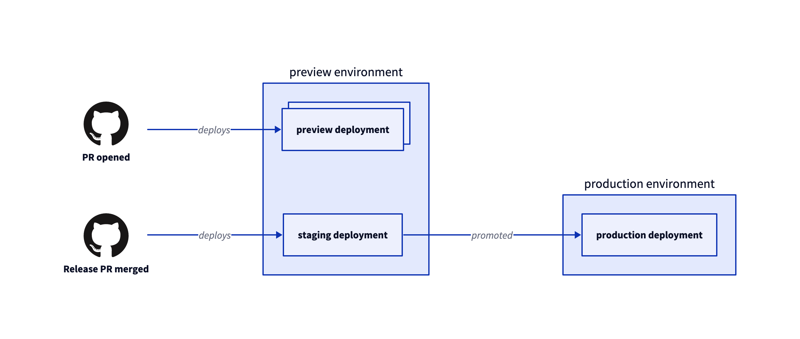

# Blazing fire

## Git workflow

Following the principles of _"trunk-based development"_ practices, all codebase modifications are merged incrementally into the `main` branch (the trunk).

To maintain a production-ready state, every change is integrated through pull requests, which undergo automated and manual verifications before the merge.

Once substantial changes has been gathered, a new release is created and a new tag (following semVer) is pushed, then manually promoted to production.

In the event of any issues, the production environment can be rollbacked to a prior tag effortlessly.

## Environments



### PR deployment

Once a PR is opened, a new _"preview"_ environment is deployed. This environment is continously updated with the lastest change synchronized on the base branch (of this PR). Once the PR is closed, the _"ephemeral"_ environment is deleted as well.

### Staging deployment

When a tag is pushed to the `main` branch, a new _"staging"_ environment gets deployed. Final verification can be done this environment before promoting it to production.

## Quick tips

### Install project dependencies

```bash
pnpm install
```

### Run npm script

```bash
pnpm <script-name>
npx turbo run <script-name>
```
