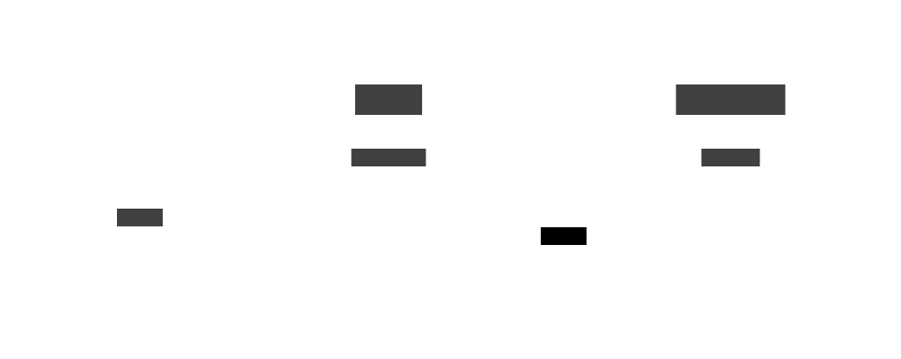

# Architecture

The app boils down to 2 things:

- the Web Tier: a SvelteKit web server that handle incoming traffic.
- the Back Tier: a Supabase instance that the web server communicates with.

## Web Tier

The SvelteKit provides a web server hosted on Vercel.

Request to Supabase are only done on the server (i.e. never on the client).

Connection to Supabase is configured with environment variables.

## Back Tier

Supabase is responsible for the **database** and the **authentication**.

There are two projects (one for production, one for developement) hosted by Supabase.
