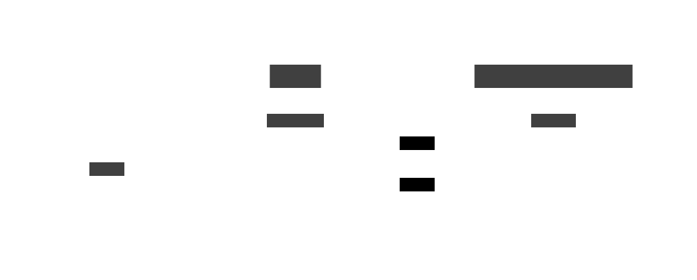

# Architecture

The app consists of two main components:

- Web Tier: A SvelteKit web server that handles incoming traffic.
- Back Tier: A Supabase instance that the web server communicates with.

## Web Tier

The SvelteKit application provides a web server hosted on Vercel.

Requests to Supabase are made only from the server (i.e., never from the client).

Connection to Supabase is configured via environment variables.

## Back Tier

Supabase manages the **database** and **authentication**.

There are two projects hosted on Supabase: one for production and one for development.
